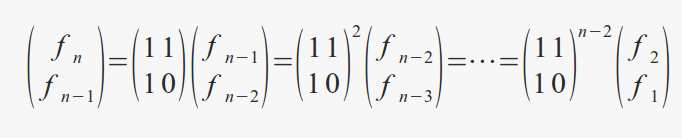

# 第八章

# 8.1

## 题目

原文：

Write a method to generate the nth Fibonacci number.

译文：

写一个函数来产生第n个斐波那契数。

## 解答

斐波那契数列的定义如下：

```
f(1) = f(2) = 1;
f(n) = f(n-1) + f(n-2);

```

这个定义是递归的，因此很容易根据以上的定义写出它的递归解法， 由于这个数列的递增速度飞快XD，我们先重定义一下long long好方便使用：

```
typedef long long ll;

```

递归版本：

```
ll fib(ll n){
    if(n < 1) return -1;
    if(n == 1 || n == 2) return 1;
    else return fib(n-1) + fib(n-2);
}

```

当然了，根据定义我们也可以很容易地写出它的非递归版本(迭代版本)：

```
ll fib1(ll n){
    if(n < 1) return -1;
    if(n == 1 || n == 2) return 1;
    ll a = 1, b = 1;
    for(ll i=3; i<=n; ++i){
        ll c = a + b;
        a = b;
        b = c;
    }
    return b;
}

```

空间复杂度O(1)，时间复杂度O(n)，看起来既简单又快速。可是，我们还有更快的解法。 根据上面的递推公式，我们可以得到它的矩阵版本：



从上图可以看出，写成矩阵递推形式，可以让我们一推到底。最后的f(1)=f(2)=1， 因此，这个问题就转换成了，如何求矩阵的幂。当然了，要快速，不然就没有什么意义了。 我们先把问题退化一下，先不考虑求矩阵的幂，而是求一个整数的幂，这个够简单的吧。

先来看看最naive的解法：(方便起见，这里假设n为非负数，不对n小于0的情况做讨论)

```
ll pow(ll m, ll n){
    ll res = 1;
    for(ll i=0; i<n; ++i)
        res *= m;
    return res;
}

```

时间复杂度O(n)。现在让我们来考虑一种更快的方法，假设我们要计算m^13 ， 然后我们把指数13写成二进制形式13=1101，一开始结果res=1.我们要计算的幂可以写成：

```
m^13 = m^1 * m^4 * m^8

```

我们可以很直观的得出，如果指数13的二进制形式1101中的某一位为1，那么， res就去乘以那一位对应的一个数。比如，1101从低位起，第1位为1，那么res乘以m^1 ， 第二位为0，res不需要乘以m^2 ，第三位为1，res乘以m^4 ，第四位为1，res乘以m^8 ， 最后得到的就是：

```
res = m^1 * m^4 * m^8

```

而且由于每次res去乘以的数(如果该位为0则不乘)都是上一次那个数的平方， 所以，这个数我用完一次，就对它取平方，准备下一次的使用即可。看代码：

```
ll pow1(ll m, ll n){
    ll res = 1;
    while(n > 0){
        if(n&1) res *= m;
        m *= m;
        n >>= 1;
    }
    return res;
}

```

时间复杂度O(logn)，正是我们想要的快速版本。OK， 这时候如果让你快速求矩阵的幂，是不是很简单了？只需要将实数乘法改成矩阵乘法即可。

```
void pow(ll s[2][2], ll a[2][2], ll n){
    while(n > 0){
        if(n&1) mul(s, s, a);
        mul(a, a, a);
        n >>= 1;
    }
}

```

基本上是一模一样的，只不过由于计算结果是矩阵，不能直接用return进行返回， 而是在函数的参数列表中返回。矩阵乘法函数如下(只考虑2*2的矩阵乘法)

```
void mul(ll c[2][2], ll a[2][2], ll b[2][2]){
    ll t[4];
    t[0] = a[0][0]*b[0][0] + a[0][1]*b[1][0];
    t[1] = a[0][0]*b[0][1] + a[0][1]*b[1][1];
    t[2] = a[1][0]*b[0][0] + a[1][1]*b[1][0];
    t[3] = a[1][0]*b[0][1] + a[1][1]*b[1][1];
    c[0][0] = t[0];
    c[0][1] = t[1];
    c[1][0] = t[2];
    c[1][1] = t[3];
}

```

于是，求斐波那契数列第n项的O(logn)解法如下：

```
ll fib2(ll n){
    if(n < 1) return -1;
    if(n == 1 || n == 2) return 1;

    ll a[2][2] = { {1, 1}, {1, 0} };
    ll s[2][2] = { {1, 0}, {0, 1} };
    pow(s, a, n-2);
    return s[0][0] + s[0][1];
}

```

完整代码如下：

```c++
#include <iostream>
using namespace std;

typedef long long ll;
ll fib(ll n){
    if(n < 1) return -1;
    if(n == 1 || n == 2) return 1;
    else return fib(n-1) + fib(n-2);
}
ll fib1(ll n){
    if(n < 1) return -1;
    if(n == 1 || n == 2) return 1;
    ll a = 1, b = 1;
    for(ll i=3; i<=n; ++i){
        ll c = a + b;
        a = b;
        b = c;
    }
    return b;
}
void mul(ll c[2][2], ll a[2][2], ll b[2][2]){
    ll t[4];
    t[0] = a[0][0]*b[0][0] + a[0][1]*b[1][0];
    t[1] = a[0][0]*b[0][1] + a[0][1]*b[1][1];
    t[2] = a[1][0]*b[0][0] + a[1][1]*b[1][0];
    t[3] = a[1][0]*b[0][1] + a[1][1]*b[1][1];
    c[0][0] = t[0];
    c[0][1] = t[1];
    c[1][0] = t[2];
    c[1][1] = t[3];
}
void pow(ll s[2][2], ll a[2][2], ll n){
    while(n > 0){
        if(n&1) mul(s, s, a);
        mul(a, a, a);
        n >>= 1;
    }
}
ll fib2(ll n){
    if(n < 1) return -1;
    if(n == 1 || n == 2) return 1;

    ll a[2][2] = { {1, 1}, {1, 0} };
    ll s[2][2] = { {1, 0}, {0, 1} };
    pow(s, a, n-2);
    return s[0][0] + s[0][1];
}
int main(){
    for(int i=1; i<20; ++i)
        cout<<fib(i)<<" ";
    cout<<endl;
    for(int i=1; i<20; ++i)
        cout<<fib1(i)<<" ";
    cout<<endl;
    for(int i=1; i<20; ++i)
        cout<<fib2(i)<<" ";
    cout<<endl;
    return 0;
}
```
# 8.2

## 题目

原文：

Imagine a robot sitting on the upper left hand corner of an NxN grid. The robot can only move in two directions: right and down. How many possible paths are there for the robot?

FOLLOW UP

Imagine certain squares are “off limits”, such that the robot can not step on them. Design an algorithm to get all possible paths for the robot.

译文：

在一个N*N矩阵的左上角坐着一个机器人，它只能向右运动或向下运动。那么， 机器人运动到右下角一共有多少种可能的路径？

进一步地，

如果对于其中的一些格子，机器人是不能踏上去的。设计一种算法来获得所有可能的路径。

## 解答

为了一般化这个问题，我们假设这个矩阵是m*n的，左上角的格子是(1, 1)， 右下角的坐标是(m, n)。

**解法一**

这个题目可以递归来解，如何递归呢？首先，我们需要一个递推公式， 对于矩阵中的格子(i, j)，假设从(1, 1)到它的路径数量为path(i, j)， 那么，有：

```
path(i, j) = path(i-1, j) + path(i, j-1)

```

很好理解，因为机器人只能向右或向下运动，因此它只能是从(i-1, j)或(i, j-1) 运动到(i, j)的，所以路径数量也就是到达这两个格子的路径数量之和。然后， 我们需要一个初始条件，也就是递归终止条件，是什么呢？可以发现， 当机器人在第一行时，不论它在第一行哪个位置，从(1, 1)到达那个位置都只有一条路径， 那就是一路向右；同理，当机器人在第一列时，也只有一条路径到达它所在位置。 有了初始条件和递推公式，我们就可以写代码了，如下：

```
ll path(ll m, ll n){
    if(m == 1 || n == 1) return 1;
    else return path(m-1, n) + path(m, n-1);
}

```

ll是数据类型long long。

**解法二**

如果用纯数学的方法来解这道题目，大概也就是个高中排列组合简单题吧。 机器人从(1, 1)走到(m, n)一定要向下走m-1次，向右走n-1次，不管这过程中是怎么走的。 因此，一共可能的路径数量就是从总的步数(m-1+n-1)里取出(m-1)步，作为向下走的步子， 剩余的(n-1)步作为向右走的步子。

```
C(m-1+n-1, m-1)=(m-1+n-1)! / ( (m-1)! * (n-1)! )

```

代码如下：

```
ll fact(ll n){
    if(n == 0) return 1;
    else return n*fact(n-1);
}
ll path1(ll m, ll n){
    return fact(m-1+n-1)/(fact(m-1)*fact(n-1));
}

```

对于第二问，如果有一些格子，机器人是不能踏上去的(比如说放了地雷XD)， 那么，我们如何输出它所有可能的路径呢？

让我们先来考虑简单一点的问题，如果我们只要输出它其中一条可行的路径即可， 那么我们可以从终点(m, n)开始回溯，遇到可走的格子就入栈， 如果没有格子能到达当前格子，当前格子则出栈。最后到达(1, 1)时， 栈中正好保存了一条可行路径。代码如下：

```
bool get_path(int m, int n){
    point p; p.x=n; p.y=m;
    sp.push(p);
    if(n==1 && m==1) return true;
    bool suc = false;
    if(m>1 && g[m-1][n])
        suc = get_path(m-1, n);
    if(!suc && n>1 && g[m][n-1])
        suc = get_path(m, n-1);
    if(!suc) sp.pop();
    return suc;
}

```

其中二维数组g表示的是M*N的矩阵，元素为1表示该位置可以走，为0表示该位置不可走。 这个只能得到其中一条可行路径，但题目是要求我们找到所有可行路径，并输出。 这样的话，又该怎么办呢？我们从(1, 1)开始，如果某个格子可以走， 我们就将它保存到路径数组中；如果不能走，则回溯到上一个格子， 继续选择向右或者向下走。当机器人走到右下角的格子(M, N)时，即可输出一条路径。 然后程序会退出递归，回到上一个格子，找寻下一条可行路径。代码如下：

```
void print_paths(int m, int n, int M, int N, int len){
    if(g[m][n] == 0) return;
    point p; p.x=n; p.y=m;
    vp[len++] = p;
    if(m == M && n == N){
        for(int i=0; i<len; ++i)
            cout<<"("<<vp[i].y<<", "<<vp[i].x<<")"<<" ";
        cout<<endl;
    }
    else{
        print_paths(m, n+1, M, N, len);
        print_paths(m+1, n, M, N, len);
    }
}

```

程序使用的输入样例8.2.in如下：

```
3 4
1 1 1 0
0 1 1 1
1 1 1 1

```

输出路径如下：

```
one of the paths:
(1, 1) (1, 2) (1, 3) (2, 3) (2, 4) (3, 4) 
all paths:
(1, 1) (1, 2) (1, 3) (2, 3) (2, 4) (3, 4) 
(1, 1) (1, 2) (1, 3) (2, 3) (3, 3) (3, 4) 
(1, 1) (1, 2) (2, 2) (2, 3) (2, 4) (3, 4) 
(1, 1) (1, 2) (2, 2) (2, 3) (3, 3) (3, 4) 
(1, 1) (1, 2) (2, 2) (3, 2) (3, 3) (3, 4)

```

完整代码如下：

```c++
#include <iostream>
#include <cstdio>
#include <stack>
using namespace std;

typedef long long ll;
typedef struct point{
    int x, y;
}point;
stack<point> sp;
const int MAXN = 20;
int g[MAXN][MAXN];
point vp[MAXN+MAXN];

ll path(ll m, ll n){
    if(m == 1 || n == 1) return 1;
    else return path(m-1, n) + path(m, n-1);
}
ll fact(ll n){
    if(n == 0) return 1;
    else return n*fact(n-1);
}
ll path1(ll m, ll n){
    return fact(m-1+n-1)/(fact(m-1)*fact(n-1));
}
bool get_path(int m, int n){
    point p; p.x=n; p.y=m;
    sp.push(p);
    if(n==1 && m==1) return true;
    bool suc = false;
    if(m>1 && g[m-1][n])
        suc = get_path(m-1, n);
    if(!suc && n>1 && g[m][n-1])
        suc = get_path(m, n-1);
    if(!suc) sp.pop();
    return suc;
}
void print_paths(int m, int n, int M, int N, int len){
    if(g[m][n] == 0) return;
    point p; p.x=n; p.y=m;
    vp[len++] = p;
    if(m == M && n == N){
        for(int i=0; i<len; ++i)
            cout<<"("<<vp[i].y<<", "<<vp[i].x<<")"<<" ";
        cout<<endl;
    }
    else{
        print_paths(m, n+1, M, N, len);
        print_paths(m+1, n, M, N, len);
    }
}
int main(){
    freopen("8.2.in", "r", stdin);
    for(int i=1; i<10; ++i)
        cout<<path(i, i)<<endl;
    cout<<endl;
    for(int i=1; i<10; ++i)
        cout<<path1(i, i)<<endl;
    cout<<endl;
    int M, N;
    cin>>M>>N;
    for(int i=1; i<=M; ++i)
        for(int j=1; j<=N; ++j)
            cin>>g[i][j];
    cout<<"one of the paths:"<<endl;        
    get_path(M, N);
    while(!sp.empty()){
        point p = sp.top();
        cout<<"("<<p.y<<", "<<p.x<<")"<<" ";
        sp.pop();
    }
    cout<<endl<<"all paths:"<<endl;
    print_paths(1, 1, M, N, 0);
    fclose(stdin);
    return 0;
}
```
# 8.3

## 题目

原文：

Write a method that returns all subsets of a set.

译文：

写一个函数返回一个集合中的所有子集。

## 解答

对于一个集合，它的子集一共有2^n 个(包括空集和它本身)。它的任何一个子集， 我们都可以理解为这个集合本身的每个元素是否出现而形成的一个序列。比如说， 对于集合{1, 2, 3}，空集表示一个元素都没出现，对应{0, 0, 0}； 子集{1, 3}，表示元素2没出现(用0表示)，1，3出现了(用1表示)，所以它对应 {1, 0, 1}。这样一来，我们发现，{1, 2, 3}的所有子集可以用二进制数000到111 的8个数来指示。泛化一下，如果一个集合有n个元素，那么它可以用0到2^n -1 总共2^n 个数的二进制形式来指示。每次我们只需要检查某个二进制数的哪一位为1， 就把对应的元素加入到这个子集就OK。代码如下：

```
typedef vector<vector<int> > vvi;
typedef vector<int> vi;
vvi get_subsets(int a[], int n){ //O(n2^n)
    vvi subsets;
    int max = 1<<n;
    for(int i=0; i<max; ++i){
        vi subset;
        int idx = 0;
        int j = i;
        while(j > 0){
            if(j&1){
                subset.push_back(a[idx]);
            }
            j >>= 1;
            ++idx;
        }
        subsets.push_back(subset);
    }
    return subsets;
}

```

解这道题目的另一种思路是递归。这道题目为什么可以用递归？ 因为我们能找到比原问题规模小却同质的问题。比如我要求{1, 2, 3}的所有子集， 我把元素1拿出来，然后去求{2, 3}的所有子集，{2, 3}的子集同时也是{1, 2, 3} 的子集，然后我们把{2, 3}的所有子集都加上元素1后，又得到同样数量的子集， 它们也是{1, 2, 3}的子集。这样一来，我们就可以通过求{2, 3}的所有子集来求 {1, 2, 3}的所有子集了。而同理，{2, 3}也可以如法炮制。代码如下：

```c++
vvi get_subsets1(int a[], int idx, int n){
    vvi subsets;
    if(idx == n){
        vi subset;
        subsets.push_back(subset); //empty set
    }
    else{
        vvi rsubsets = get_subsets1(a, idx+1, n);
        int v = a[idx];
        for(int i=0; i<rsubsets.size(); ++i){
            vi subset = rsubsets[i];
            subsets.push_back(subset);
            subset.push_back(v);
            subsets.push_back(subset);
        }
    }
    return subsets;
}

```

完整代码如下：

```c++
#include <iostream>
#include <vector>
using namespace std;

typedef vector<vector<int> > vvi;
typedef vector<int> vi;
vvi get_subsets(int a[], int n){ //O(n2^n)
    vvi subsets;
    int max = 1<<n;
    for(int i=0; i<max; ++i){
        vi subset;
        int idx = 0;
        int j = i;
        while(j > 0){
            if(j&1){
                subset.push_back(a[idx]);
            }
            j >>= 1;
            ++idx;
        }
        subsets.push_back(subset);
    }
    return subsets;
}
vvi get_subsets1(int a[], int idx, int n){
    vvi subsets;
    if(idx == n){
        vi subset;
        subsets.push_back(subset); //empty set
    }
    else{
        vvi rsubsets = get_subsets1(a, idx+1, n);
        int v = a[idx];
        for(int i=0; i<rsubsets.size(); ++i){
            vi subset = rsubsets[i];
            subsets.push_back(subset);
            subset.push_back(v);
            subsets.push_back(subset);
        }
    }
    return subsets;
}
void print_subsets(vvi subsets){
    for(int i=0; i<subsets.size(); ++i){
        vi subset = subsets[i];
        for(int j=0; j<subset.size(); ++j){
            cout<<subset[j]<<" ";
        }
        cout<<endl;
    }
}
int main(){
    int a[] = {
        1, 2, 3, 4
    };
    vvi sub = get_subsets(a, 4);
    vvi sub1 = get_subsets1(a, 0, 4);
    print_subsets(sub);
    print_subsets(sub1);
    
    return 0;
}

```


# 8.4

## 题目

原文：

Write a method to compute all permutations of a string

译文：

写一个函数返回一个串的所有排列

## 解答

对于一个长度为n的串，它的全排列共有A(n, n)=n!种。这个问题也是一个递归的问题， 不过我们可以用不同的思路去理解它。为了方便讲解，假设我们要考察的串是”abc”， 递归函数名叫permu。

**思路一：**

我们可以把串“abc”中的第0个字符a取出来，然后递归调用permu计算剩余的串“bc” 的排列，得到{bc, cb}。然后再将字符a插入这两个串中的任何一个空位(插空法)， 得到最终所有的排列。比如，a插入串bc的所有(3个)空位，得到{abc,bac,bca}。 递归的终止条件是什么呢？当一个串为空，就无法再取出其中的第0个字符了， 所以此时返回一个空的排列。代码如下：

```
typedef vector<string> vs;

vs permu(string s){
    vs result;
    if(s == ""){
        result.push_back("");
        return result;
    }
    string c = s.substr(0, 1);
    vs res = permu(s.substr(1));
    for(int i=0; i<res.size(); ++i){
        string t = res[i];
        for(int j=0; j<=t.length(); ++j){
            string u = t;
            u.insert(j, c);
            result.push_back(u);
        }
    }
    return result; //调用result的拷贝构造函数，返回它的一份copy，然后这个局部变量销毁(与基本类型一样)
}

```

**思路二：**

我们还可以用另一种思路来递归解这个问题。还是针对串“abc”， 我依次取出这个串中的每个字符，然后调用permu去计算剩余串的排列。 然后只需要把取出的字符加到剩余串排列的每个字符前即可。对于这个例子， 程序先取出a，然后计算剩余串的排列得到{bc,cb}，然后把a加到它们的前面，得到 {abc,acb}；接着取出b，计算剩余串的排列得到{ac,ca}，然后把b加到它们前面， 得到{bac,bca}；后面的同理。最后就可以得到“abc”的全序列。代码如下：

```
vs permu1(string s){
    vs result;
    if(s == ""){
        result.push_back("");
        return result;
    }
    for(int i=0; i<s.length(); ++i){
        string c = s.substr(i, 1);
        string t = s;
        vs res = permu1(t.erase(i, 1));
        for(int j=0; j<res.size(); ++j){
            result.push_back(c + res[j]);
        }
    }
    return result;
}

```

完整代码如下：

```c++
#include <iostream>
#include <vector>
using namespace std;

typedef vector<string> vs;

vs permu(string s){
    vs result;
    if(s == ""){
        result.push_back("");
        return result;
    }
    string c = s.substr(0, 1);
    vs res = permu(s.substr(1));
    for(int i=0; i<res.size(); ++i){
        string t = res[i];
        for(int j=0; j<=t.length(); ++j){
            string u = t;
            u.insert(j, c);
            result.push_back(u);
        }
    }

    return result; //调用result的拷贝构造函数，返回它的一份copy，然后这个局部变量销毁(与基本类型一样)
}

vs permu1(string s){
    vs result;
    if(s == ""){
        result.push_back("");
        return result;
    }
    for(int i=0; i<s.length(); ++i){
        string c = s.substr(i, 1);
        string t = s;
        vs res = permu1(t.erase(i, 1));
        for(int j=0; j<res.size(); ++j){
            result.push_back(c + res[j]);
        }
    }
    return result;
}
int main(){
    string s = "abc";
    vs res = permu1(s);
    for(int i=0; i<res.size(); ++i)
        cout<<res[i]<<endl;
    return 0;
}
```

# 8.5

## 题目

原文：

Implement an algorithm to print all valid (e.g., properly opened and closed) combinations of n-pairs of parentheses.

EXAMPLE:

input: 3 (e.g., 3 pairs of parentheses)

output: ((())), (()()), (())(), ()(()), ()()()

译文：

实现一个算法打印出n对括号的有效组合。

例如：

输入：3 （3对括号）

输出：((())), (()()), (())(), ()(()), ()()()

## 解答

对于括号的组合，要考虑其有效性。比如说，)(， 它虽然也是由一个左括号和一个右括号组成，但它就不是一个有效的括号组合。 那么，怎样的组合是有效的呢？对于一个左括号，在它右边一定要有一个右括号与之配对， 这样的才能是有效的。所以，对于一个输出，比如说(()())， 从左边起，取到任意的某个位置得到的串，左括号数量一定是大于或等于右括号的数量， 只有在这种情况下，这组输出才是有效的。我们分别记左，右括号的数量为left和right， 如下分析可看出，(()())是个有效的括号组合。

```
(, left = 1, right = 0
((, left = 2, right = 0
((), left = 2, right = 1
(()(, left = 3, right = 1
(()(), left = 3, right = 2
(()()), left = 3, right = 3

```

这样一来，在程序中，只要还有左括号，我们就加入输出串，然后递归调用。 当退出递归时，如果剩余的右括号数量比剩余的左括号数量多，我们就将右括号加入输出串。 直到最后剩余的左括号和右括号都为0时，即可打印一个输出串。代码如下：

```
void print_pare(int l, int r, char str[], int cnt){
    if(l<0 || r<l) return;
    if(l==0 && r==0){
        for(int i=0; i<cnt; ++i){
            cout<<str[i];
        }
        cout<<", ";
    }
    else{
        if(l > 0){
            str[cnt] = '(';
            print_pare(l-1, r, str, cnt+1);
        }
        if(r > l){
            str[cnt] = ')';
            print_pare(l, r-1, str, cnt+1);
        }
    }
}

```

完整代码如下：

```c++
#include <iostream>
using namespace std;

void print_pare(int l, int r, char str[], int cnt){
    if(l<0 || r<l) return;
    if(l==0 && r==0){
        for(int i=0; i<cnt; ++i){
            cout<<str[i];
        }
        cout<<", ";
    }
    else{
        if(l > 0){
            str[cnt] = '(';
            print_pare(l-1, r, str, cnt+1);
        }
        if(r > l){
            str[cnt] = ')';
            print_pare(l, r-1, str, cnt+1);
        }
    }
}
int main(){
    int cnt = 3;
    char str[2*cnt];
    print_pare(cnt, cnt, str, 0);
    return 0;
}
```

